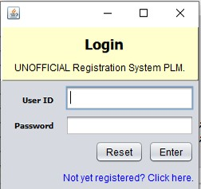
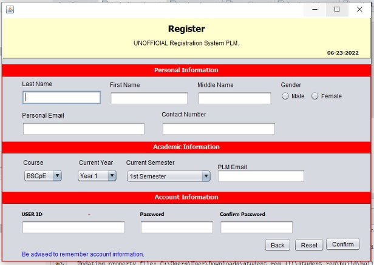
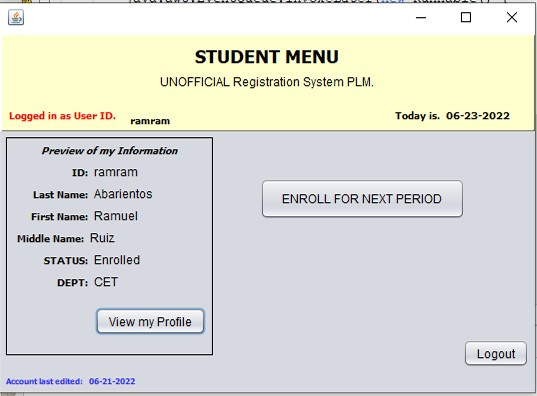
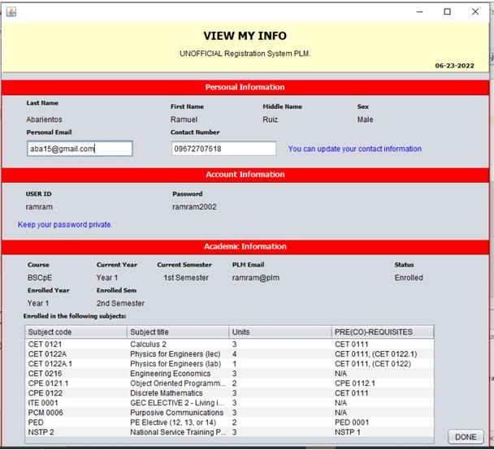
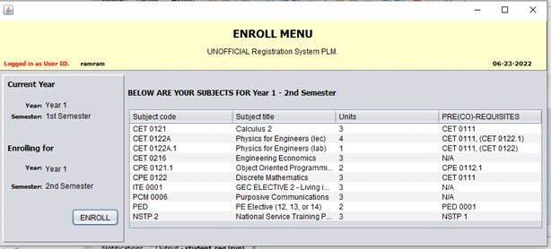

# Student Registration System (Java)



## 📝 Table of Contents
* [About The Project](#about-the-project)
* [Key Features](#key-features)
* [Technologies Used](#technologies-used)
* [Screenshots](#screenshots)
* [Getting Started](#getting-started)
  * [Prerequisites](#prerequisites)
  * [Installation & Setup](#installation--setup)
  * [Running the Application](#running-the-application)
* [How to Use](#how-to-use)
* [Author](#author)

## About The Project

The "UNOFFICIAL Registration System PLM" is a Java-based desktop application designed to manage student registration and academic information. It provides a user interface for students to register, log in, view their profiles, check enrolled subjects, and enroll for upcoming academic periods, with data persisted in a relational database.

This project demonstrates a practical application of Java for building interactive desktop GUI applications with database integration for data management.

## Key Features

* **User Authentication:**
    * Secure user login with User ID and Password.
    * New user registration module.
* **Student Information Management:**
    * Comprehensive student registration capturing personal, academic, and account details stored in a database.
    * View and manage student profiles.
    * Display of current enrollment status and departmental information.
* **Academic Enrollment:**
    * View currently enrolled subjects, including details like subject code, title, units, and prerequisites.
    * Functionality to enroll in subjects for the next academic period.
* **User-Friendly Interface:**
    * Graphical User Interface (GUI) for easy navigation and interaction.
    * Forms for data entry and display.
* **Database Integration:**
    * Uses JDBC to connect to a relational database for storing and retrieving student and academic data.

## Technologies Used

* **Programming Language:** Java
* **GUI:** Java Swing (or JavaFX, based on the appearance - please specify if known)
* **Database:** MySQL (or other similar relational database)
* **Database Connectivity:** JDBC (Java Database Connectivity)
* **IDE (Recommended):** IntelliJ IDEA, Eclipse, or NetBeans
* **Build Tool (Optional):** Maven or Gradle (if used)

## Screenshots

* **Login Screen:**
    * 
* **Registration Form:**
    * 
* **Student Main Menu/Dashboard:**
    * 
* **View My Info/Profile Screen:**
    * 
* **Enrollment Screen:**
    * 

## Getting Started

To get a local copy up and running, follow these steps.

### Prerequisites

* **Java Development Kit (JDK):** Version 8 or higher (please specify the exact version if critical). You can download it from [Oracle JDK](https://www.oracle.com/java/technologies/downloads/) or [OpenJDK](https://openjdk.java.net/).
* **Database System:** MySQL Server (or the specific SQL database you are using) installed and running.
* **JDBC Driver:** The appropriate JDBC driver for your database (e.g., MySQL Connector/J for MySQL). Ensure this driver is included in your project's classpath or build configuration.
* **(Optional) IDE:** An Integrated Development Environment like IntelliJ IDEA, Eclipse, or NetBeans.

### Installation & Setup

1.  **Clone the repository (if it's on Git):**
    ```sh
    git clone [https://github.com/hozestooo/Student-Registration-System-Java-.git](https://github.com/hozestooo/Student-Registration-System-Java-.git)
    cd Student-Registration-System-Java-
    ```

2.  **Database Configuration:**
    * **Database Setup:**
        * Ensure your MySQL (or other specified database) server is running.
        * Create a database for this application (e.g., `student_db`).
        * Create the required tables. Based on the code snippet, a table named `student_registration` is used. You should document its schema (column names and types). For example:
          ```sql
          CREATE TABLE student_registration (
              id VARCHAR(255) PRIMARY KEY,
              password VARCHAR(255),
              access_type INT,
              last_name VARCHAR(255),
              first_name VARCHAR(255),
              middle_name VARCHAR(255),
              sex VARCHAR(10),
              course VARCHAR(255),
              dept VARCHAR(255),
              enrolling_status INT,
              plm_email VARCHAR(255),
              personal_email VARCHAR(255),
              contact_number VARCHAR(255),
              date_registered VARCHAR(255),
              year VARCHAR(255),
              semester VARCHAR(255),
              column17_name VARCHAR(255), 
              column18_name VARCHAR(255)
          );
          ```
    * **Connection Details:**
        * Explain how the Java application connects to the database. This usually involves a connection string (URL), database username, and password.
        * Specify where these connection details are configured in the code (e.g., hardcoded in a specific class, read from a properties file). For instance, the `Connection con = ...;` part of your JDBC code.
    * **JDBC Driver:**
        * Ensure the JDBC driver JAR file (e.g., `mysql-connector-java-X.X.XX.jar`) is added to your project's build path/dependencies (e.g., in your IDE's library settings, or `pom.xml` / `build.gradle` if using Maven/Gradle).

3.  **Project Setup in IDE (Optional but Recommended):**
    * Instructions for opening/importing the project in a common Java IDE.
    * Ensure the IDE recognizes the JDBC driver.

### Running the Application

* **If using an IDE:**
    * Locate the main class (e.g., `Main.java` or `App.java` containing the `public static void main(String[] args)` method).
    * Right-click on the file and select "Run" or "Debug."

* **From the Command Line (if applicable, e.g., for simple projects or if a JAR is built):**
    1.  Compile the Java source files (ensure the JDBC driver is in the classpath):
        ```sh
        javac -cp "path/to/your/jdbc_driver.jar:." YourMainClass.java #
        ```
    2.  Run the application (ensure the JDBC driver is in the classpath):
        ```sh
        java -cp "path/to/your/jdbc_driver.jar:." YourMainClass # (use ; instead of : on Windows for classpath)
        ```
    * If you provide a runnable JAR file (ensure the JAR manifest includes the classpath or the driver is bundled):
        ```sh
        java -jar RegistrationSystem.jar
        ```

## How to Use

1.  Launch the application using the methods described in the "Running the Application" section, ensuring the database is set up and accessible.
2.  If you are a new user, click on the "Not yet registered? Click here." link (or similar) on the login screen to access the registration form.
3.  Fill out the registration form with your personal, academic, and desired account details. This information will be saved to the database.
4.  Once registered, log in using your User ID and Password. The system will verify your credentials against the database.
5.  After logging in, you will see the Student Menu. From here, you can:
    * View your profile information (retrieved from the database).
    * Check your currently enrolled subjects.
    * Proceed to enroll for the next academic period.
6.  Follow the on-screen prompts and buttons to navigate through different sections like viewing info or enrolling in subjects.

## Author

* **HONESTO E. VICENTE**
* [Link to GitHub Profile](https://github.com/hozestooo)
